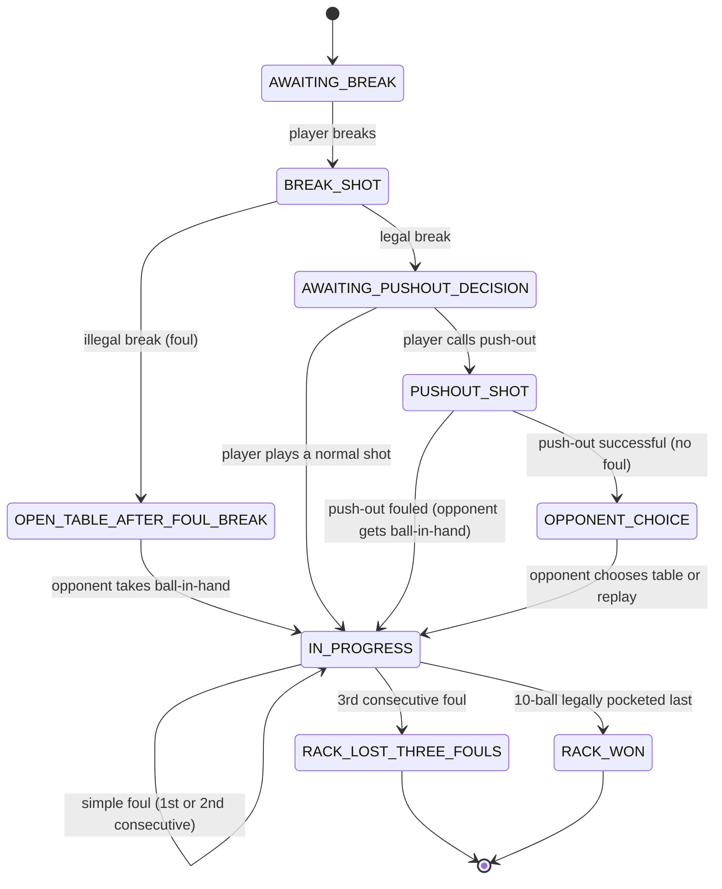

# Domain Model — 10-Ball

This document is the reference to give Cursor **before** generating anything in the `domain` layer. All business logic generation must be based on these entities and this state machine, not on a free reinterpretation of the rules.

## 1. Core entities

### `Player`
```kotlin
data class Player(
    val id: PlayerId,
    val name: String,
)
```

### `Match`
A match consists of several racks between 2 players, until one player reaches the required number of racks won.
```kotlin
data class Match(
    val id: MatchId,
    val player1: Player,
    val player2: Player,
    val racksToWin: Int,
    val racks: List<Rack>,
    val status: MatchStatus, // NOT_STARTED, IN_PROGRESS, COMPLETED
)
```

### `Rack` (a single 10-ball game)
```kotlin
data class Rack(
    val id: RackId,
    val breakingPlayer: PlayerId,
    val currentPlayer: PlayerId,
    val ballsOnTable: Set<Int>, // 1..10, shrinks as the rack progresses
    val consecutiveFouls: Map<PlayerId, Int>,
    val phase: RackPhase, // see state machine below
    val winner: PlayerId?,
)
```

### `Ball`
```kotlin
typealias BallNumber = Int // 1..10
```
No need for a rich entity in the MVP — a simple set of integers is enough to represent "still on the table".

### `Shot`
```kotlin
data class Shot(
    val playerId: PlayerId,
    val calledBall: BallNumber?,      // null if "Safety" or push-out
    val calledPocket: Pocket?,
    val isPushOut: Boolean,
    val isSafety: Boolean,
    val outcome: ShotOutcome,
)
```

### `ShotOutcome` (result of a shot, computed by the domain layer from user input)
```kotlin
sealed interface ShotOutcome {
    data class LegalPot(val pottedBalls: Set<BallNumber>) : ShotOutcome
    data class IllegalPot(val pottedBalls: Set<BallNumber>, val foul: FoulType) : ShotOutcome
    data class Miss(val safety: Boolean) : ShotOutcome
    data class Foul(val foul: FoulType) : ShotOutcome
    object RackWon : ShotOutcome
}
```

### `FoulType`
```kotlin
enum class FoulType {
    CUE_BALL_POCKETED_OR_OFF_TABLE,
    WRONG_BALL_FIRST,
    NO_RAIL_AFTER_CONTACT,
    FOOT_OFF_FLOOR,
    OBJECT_BALL_OFF_TABLE,
    BALL_TOUCHED_MOVED,
    BALLS_STILL_MOVING,
    BALL_IN_HAND_MISPLACED,
    OUT_OF_TURN,
    WRONG_CUE_BALL,
    ILLEGAL_BREAK,
    TEN_BALL_EARLY_OR_WRONG_POCKET,
}
```

## 2. Rack state machine (`RackPhase`)



## 3. Sequencing rules to encode (executable summary)

1. **Break**:
   - Ball 1 not contacted first → foul → opponent ball-in-hand (anywhere on the table).
   - No ball pocketed + fewer than 4 balls hit a rail → foul (illegal break) → opponent ball-in-hand.
   - Legal break → the breaking player may call a push-out before their next shot.

2. **Push-out**:
   - Special shot, once per rack, reserved for the player who just made a legal break.
   - Result without a foul → the **opponent** chooses who plays the next shot.
   - Result with a foul → opponent gets ball-in-hand.

3. **Normal shot**:
   - Verify the called ball is the lowest-numbered ball still on the table, or was legally contacted first via a valid combination (MVP simplification: ask "which ball did you contact first" + "which ball did you pocket" and compare against `ballsOnTable`).
   - 10-ball pocketed while it isn't the last ball, or uncalled → **respot** the 10-ball; this is not a foul by itself *unless* general foul conditions are otherwise met.
   - Called ball pocketed correctly → the player continues.
   - Non-called ball pocketed / wrong pocket → turn passes, no foul penalty, balls stay pocketed (except the 10-ball, see §6 of the rules doc).

4. **Consecutive fouls**:
   - Increment `consecutiveFouls[playerId]` on every foul.
   - Reset to 0 as soon as that player plays a legal shot (pot or valid safety, without a foul).
   - On the 3rd consecutive foul → immediate loss of the rack.

5. **End of rack**:
   - 10-ball legally pocketed last, in the called pocket → `RACK_WON`.
   - Three consecutive fouls → `RACK_LOST_THREE_FOULS`.

## 4. Use cases (`domain/usecase`)

- `StartMatchUseCase`
- `StartRackUseCase`
- `RecordBreakShotUseCase`
- `DeclarePushOutUseCase`
- `RecordShotUseCase` (core rules engine — receives shot input, returns a `ShotOutcome` and updates the `Rack`)
- `ResolveRackEndUseCase`
- `GetMatchHistoryUseCase`

## 5. Deliberately not modeled in v1

- Actual ball positions on the table (the app doesn't simulate physics, only score and "pocketed / on table" state).
- Camera-assisted foul detection / automated refereeing.
- Masters-specific rules (break box).

For any rule missing from this document, refer to `docs/02-game-rules-10-ball.md`, then, as a last resort, the source PDF.
