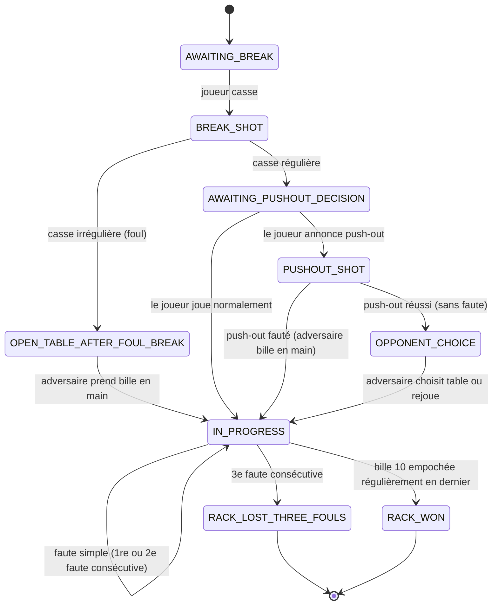

# Modèle de domaine — Jeu de la 10

Ce document est la référence à donner à Cursor **avant** de générer la couche `domain`. Toute génération de code métier doit s'appuyer sur ces entités et cette machine à états, pas sur une réinterprétation libre des règles.

## 1. Entités principales

### `Player`
```
Player(
  id: PlayerId,
  name: String
)
```

### `Match`
Un match = plusieurs manches (`Rack`) entre 2 joueurs, jusqu'à ce qu'un joueur atteigne le nombre de manches requis.
```
Match(
  id: MatchId,
  player1: Player,
  player2: Player,
  racksToWin: Int,
  racks: List<Rack>,
  status: MatchStatus // NOT_STARTED, IN_PROGRESS, COMPLETED
)
```

### `Rack` (une manche de 10-ball)
```
Rack(
  id: RackId,
  breakingPlayer: PlayerId,
  currentPlayer: PlayerId,
  ballsOnTable: Set<BallNumber>, // 1..10, décroît au fil du jeu
  consecutiveFouls: Map<PlayerId, Int>,
  phase: RackPhase, // voir machine à états
  winner: PlayerId?
)
```

### `Ball`
```
BallNumber = Int (1..10)
```
Pas besoin d'entité riche pour la bille en MVP — un simple set d'entiers suffit pour représenter "encore sur la table".

### `Shot` (un coup)
```
Shot(
  playerId: PlayerId,
  calledBall: BallNumber?,      // null si "Défense" ou push-out
  calledPocket: Pocket?,
  isPushOut: Boolean,
  isSafety: Boolean,
  outcome: ShotOutcome
)
```

### `ShotOutcome` (résultat d'un coup, calculé par le domaine à partir de la saisie utilisateur)
```
sealed class ShotOutcome {
  data class LegalPot(pottedBalls: Set<BallNumber>) : ShotOutcome()
  data class IllegalPot(pottedBalls: Set<BallNumber>, foul: FoulType) : ShotOutcome()
  data class Miss(safety: Boolean) : ShotOutcome()
  data class Foul(foul: FoulType) : ShotOutcome()
  object RackWon : ShotOutcome()
}
```

### `FoulType`
```
enum class FoulType {
  CUE_BALL_POCKETED_OR_OFF_TABLE,
  WRONG_BALL_FIRST,
  NO_RAIL_AFTER_CONTACT,
  FOOT_OFF_FLOOR,
  OBJECT_BALL_OFF_TABLE,
  BALL_TOUCHED_MOVED,
  BALLS_STILL_MOVING,
  BALL_IN_HAND_MISPLACED,
  OUT_OF_TURN,
  WRONG_CUE_BALL,
  ILLEGAL_BREAK,
  TEN_BALL_EARLY_OR_WRONG_POCKET
}
```

## 2. Machine à états d'une manche (`RackPhase`)



## 3. Règles d'enchaînement à encoder (résumé exécutable)

1. **Casse** :
   - Contact bille n°1 non respecté → faute → bille en main adversaire (sur toute la table).
   - Aucune bille empochée + moins de 4 billes en bande → faute (casse irrégulière) → bille en main adversaire.
   - Casse régulière → le joueur qui casse peut annoncer un push-out avant son prochain coup.

2. **Push-out** :
   - Coup spécial, une fois par manche, réservé au joueur qui vient de faire une casse régulière.
   - Résultat sans faute → l'**adversaire** choisit qui joue le coup suivant.
   - Résultat avec faute → adversaire bille en main.

3. **Coup normal** :
   - Vérifier que la bille annoncée est bien la plus petite bille encore sur la table, ou qu'elle a été touchée en premier par carambolage légal (simplification MVP : on peut se contenter de demander "quelle bille avez-vous touchée en premier" + "quelle bille avez-vous empochée" et comparer au set `ballsOnTable`).
   - Bille 10 empochée alors que ce n'est pas la dernière bille, ou hors annonce → **respot** de la bille 10, pas de foul en soi *sauf* si les conditions de foul générales sont par ailleurs réunies.
   - Bille annoncée empochée correctement → le joueur continue.
   - Bille non annoncée empochée / mauvaise poche → main passe, aucune pénalité de faute (pas de foul), billes restent empochées (sauf la 10, cf. §6 du doc règles).

4. **Fautes consécutives** :
   - Incrémenter `consecutiveFouls[playerId]` à chaque faute.
   - Remettre à 0 dès que ce joueur joue un coup régulier (empoche ou défense valide sans faute).
   - Sur la 3e faute consécutive → perte immédiate de la manche.

5. **Fin de manche** :
   - Bille 10 empochée régulièrement, en dernier, dans la poche annoncée → `RACK_WON`.
   - 3 fautes consécutives → `RACK_LOST_THREE_FOULS`.

## 4. Use cases (couche `domain/usecases`)

- `StartMatchUseCase`
- `StartRackUseCase`
- `RecordBreakShotUseCase`
- `DeclarePushOutUseCase`
- `RecordShotUseCase` (coeur du moteur de règles — reçoit la saisie du coup, retourne un `ShotOutcome` et met à jour le `Rack`)
- `ResolveRackEndUseCase`
- `GetMatchHistoryUseCase`

## 5. Ce qui n'est volontairement pas modélisé en v1

- Position réelle des billes sur la table (l'app ne simule pas la physique, uniquement le score et l'état "empochée / sur la table").
- Arbitrage assisté / détection automatique de faute par caméra.
- Les règles spécifiques Masters (break box).

Pour toute règle absente de ce document, se référer à `docs/02-regles-jeu-de-la-10.md`, puis en dernier recours au PDF source.
